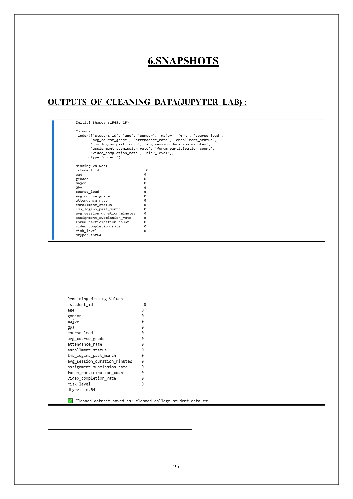
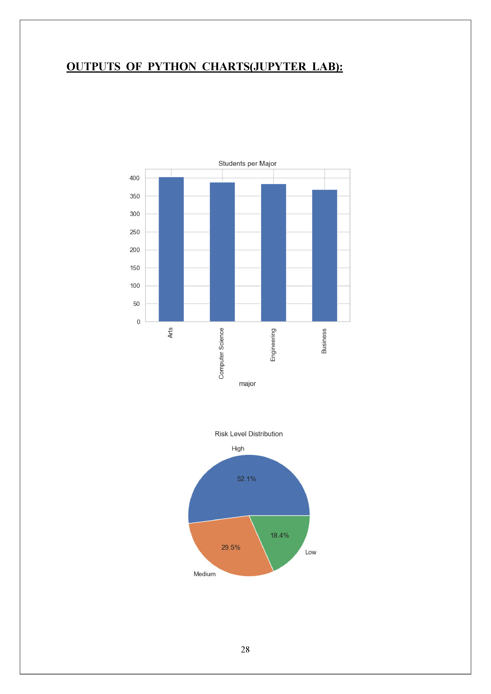
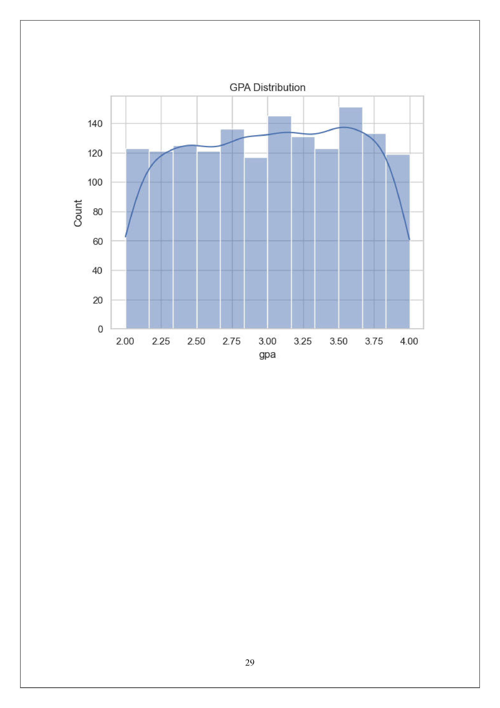
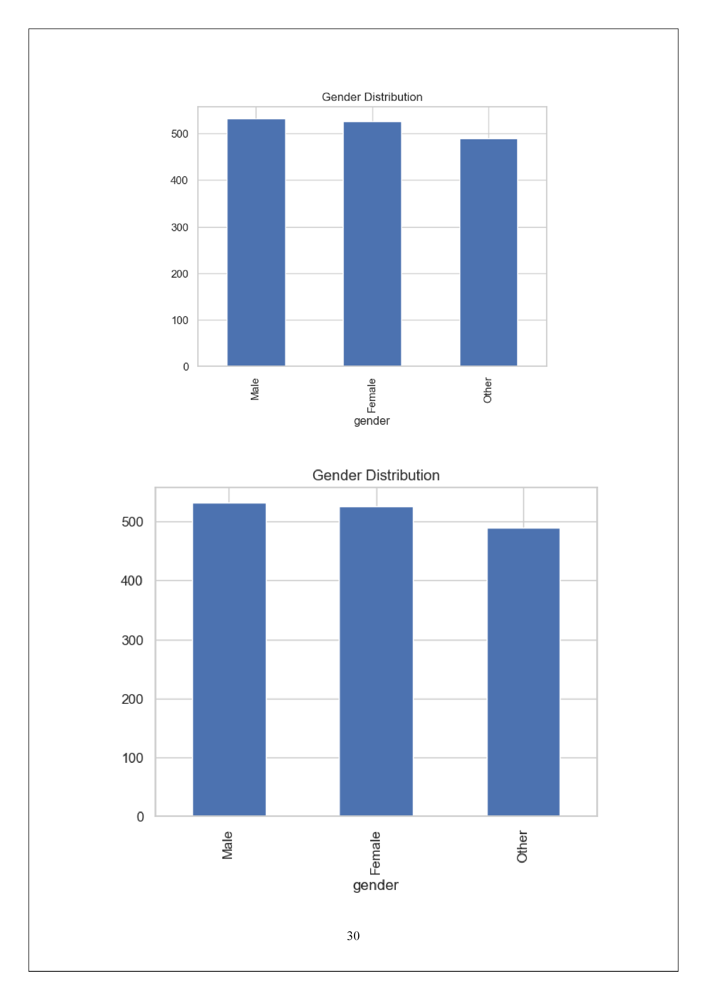
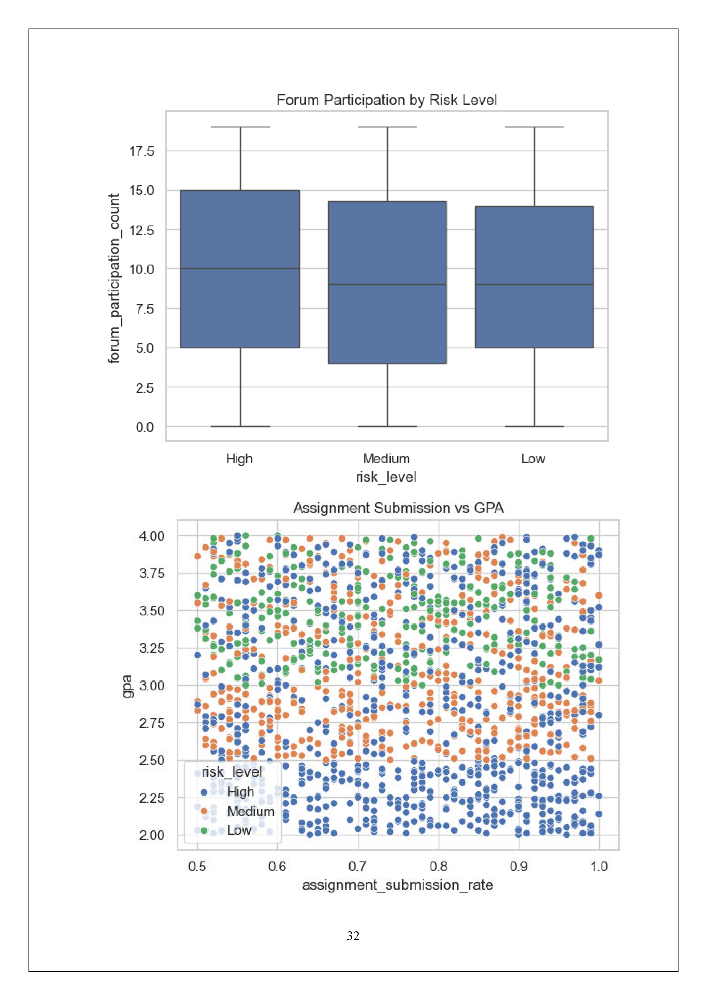
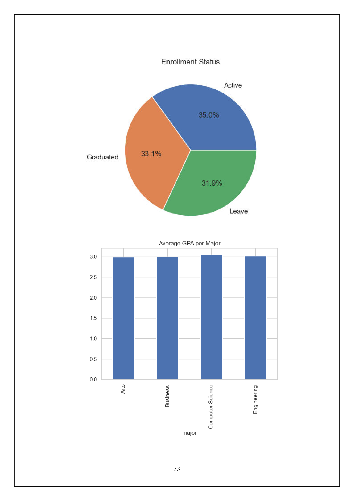
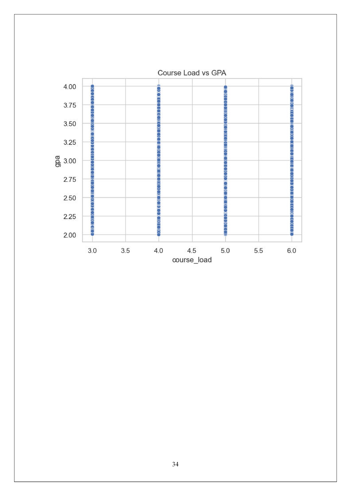

# 🎓 Student Performance Analysis

## Project Overview
End-to-end student performance analytics project using MySQL, FastAPI, Streamlit, Plotly and Power BI.

## Features
- Student performance analysis
- GPA and attendance insights
- Risk level analysis
- Interactive Streamlit dashboard
- FastAPI backend
- Power BI dashboard

## Tech Stack
Python, MySQL, SQL Stored Procedures, FastAPI, Streamlit, Plotly, Pandas, Power BI

## Project Structure
```
api/
dashboard/
sql/
data/
images/
README.md
requirements.txt
.gitignore
```

## Installation
```bash
pip install -r requirements.txt
```

## Run FastAPI
```bash
uvicorn coll_project:app --reload
```

## Run Dashboard
```bash
streamlit run dashboard.py
```

## Database
Import `college_management.sql` into MySQL and update the credentials in `coll_project.py`.

## Project Documentation

## 📷 Project Screenshots

### Data Cleaning


### Major-wise Student Distribution


### GPA Distribution


### Gender Distribution


### Attendance vs GPA


### Assignment Submission vs GPA


### Enrollment Status


## Author
Jatin Talreja
